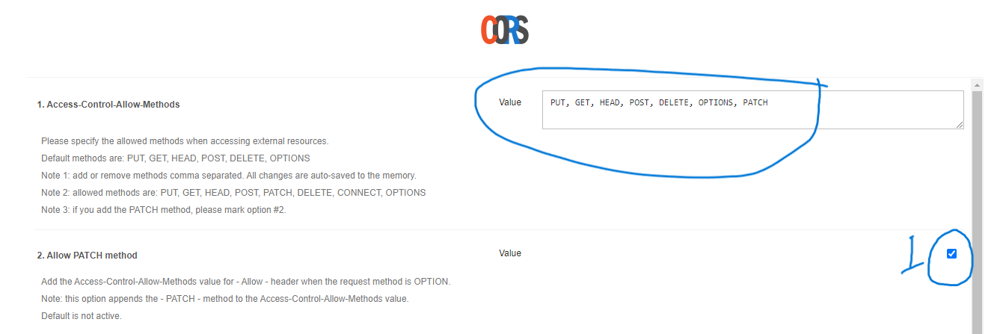

# Golang Final Project Jery Hardianto | 152308829101-64

## Sebelum menggunakan App Donwload extension CORS https://chrome.google.com/webstore/detail/allow-cors-access-control/lhobafahddgcelffkeicbaginigeejlf 

### Masuk ke extension
1. Klik toggel ON untuk mengaktifkan
2. Klik Open Options Page

  
  
3. Ceklist Allow PATCH method
   
   
## Link Final App TodoList https://frontend-final-project-dts.herokuapp.com/

## Stack yang digunakan :
### Backend 
  1. Golang
  2. MySQL
  3. httprouter 
  4. HeroKu
### Frontend
  1. HTML
  2. Bootstrap v5
  3. AJAX

